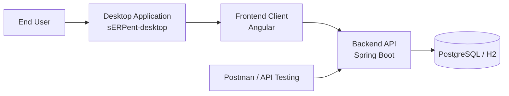
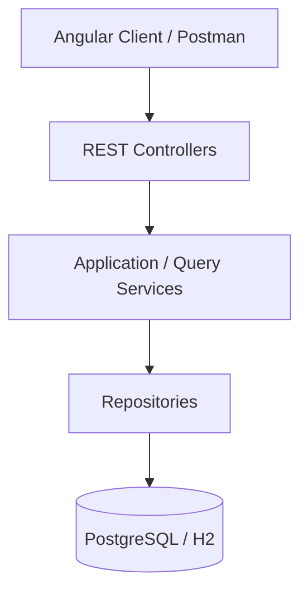
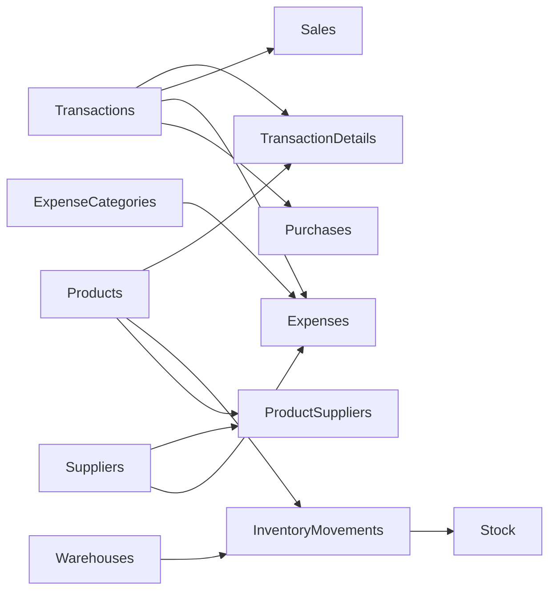

# sERPent


Modular ERP backend designed for small and medium-sized businesses.

sERPent focuses on transactional operations, warehouse-based inventory management, and a clean architecture that can evolve over time without requiring major redesigns.

The goal of the project is to provide a **practical ERP backend foundation** that supports real-world business workflows such as product management, sales, inventory tracking, and supplier purchasing.

---

## Project Ecosystem

This repository contains the backend of the sERPent ERP system.

The full platform is planned as a multi-repository application composed of:

- `sERPent-backend` for business logic and API services
- `sERPent-frontend` for the Angular user interface
- `sERPent-desktop` for **Electron-based desktop packaging and distribution**

The long-term product vision is a **desktop ERP application built with Angular and Electron**, powered by the backend services provided in this repository.

---

## ERP System Architecture

The following diagram shows the intended high-level architecture of the full sERPent platform.



This architecture separates responsibilities between desktop distribution, frontend interaction, backend business logic, and persistence.

---

## High Level Backend Architecture

The backend follows a modular layered architecture with clear separation between API, business workflows, and persistence.



Controllers expose the API surface, services orchestrate business workflows, repositories handle persistence, and the database stores transactional state.

---

## Domain Model Overview

The following diagram illustrates the main domain relationships inside the ERP.



This model reflects the core design decisions of the system:

- **transactions as the operational root**
- **movement-based inventory**
- **separation between inventory history and stock visibility**
- **integration of suppliers and expenses into the transaction model**

---

## Project Status

The **core transactional and inventory backend is already implemented and functional**.

The project is currently in a **core consolidation phase**, focusing on:

- architecture consistency
- API stabilization
- improving internal workflows
- preparing the system for future modules

The backend already supports:

- transactional sales
- supplier purchases
- movement-based inventory
- optimized stock queries

This repository represents an **active development project**, and additional ERP capabilities will be added incrementally.

---

## Tech Stack

- Java
- Spring Boot
- Spring Data JPA
- Hibernate
- MapStruct
- PostgreSQL
- H2 (development database)
- Flyway (database migrations)
- Postman (API testing)
- JUnit 5
- Mockito
- JaCoCo

---

## Current Modules

The backend currently includes the following core modules.

---

### Product Catalog

Features:

- product creation
- product updates
- optional SKU support
- product search by name
- active product listing

Validations:

- price cannot be null
- price cannot be negative
- SKU must be unique if present

Additional inventory configuration fields include:

- `minimumStock`
- `reorderPoint`
- `reorderQuantity`

These allow the system to support future replenishment logic.

---

### Users

Features:

- user creation
- user updates
- active user listing

Validations:

- username cannot be blank
- username must be unique
- email must be unique if present

---

### Payment Methods

Features:

- payment method creation
- updates
- active payment method listing

Validations:

- name cannot be blank
- name must be unique

---

### Warehouses

Features:

- warehouse creation
- warehouse updates
- active warehouse listing

Validations:

- name cannot be blank
- name must be unique

---

### Transactions

The system uses a **generic transaction model**.

Features:

- paginated transaction search
- filtering by type
- filtering by status
- filtering by date range
- filtering by user
- filtering by payment method
- description text search
- transaction detail retrieval

---

### Sales

Sales are implemented as a **business workflow built on top of transactions**.

Features:

- stock validation before sale
- transaction creation
- transaction detail creation
- sale record creation
- inventory movement registration

Validations:

- insufficient stock
- duplicate invoice number
- negative unit price
- product existence validation
- user existence validation
- payment method validation

Sales automatically register **inventory OUT movements**.

---

### Purchases

Purchases represent **inbound stock operations from suppliers**.

Features:

- purchase registration
- supplier association
- transaction creation
- transaction detail creation
- inbound inventory movement registration

Purchases automatically register **inventory IN movements** and update the current stock.

This workflow is implemented through `PurchaseApplicationService`.

---

### Inventory Movements

Inventory is **movement-based**, not stored directly in products.

Features:

- full movement history
- movement registration for sales
- movement registration for purchases
- adjustment movements
- transfer movements

Supported movement types:

- IN
- OUT
- ADJUSTMENT_IN
- ADJUSTMENT_OUT
- TRANSFER_IN
- TRANSFER_OUT
- RETURN_IN

Movement history acts as the **inventory ledger**.

---

### Inventory Snapshot

To allow fast stock queries, the system also maintains an optimized stock snapshot.

Table:

```
inventory_stock_snapshot
```

This table stores the **current stock balance per product and warehouse**.

Snapshots are automatically updated through:

```
InventoryStockSnapshotService
```

Key operations include:

- applying movements
- rebuilding snapshot from ledger
- reconciling snapshot against movement history
- detecting inconsistencies

This architecture combines:

- **ledger accuracy**
- **fast read performance**

---

### Stock Queries

Stock visibility is separated from movement history.

Features:

- stock by product
- stock by warehouse
- stock by product and warehouse
- grouped stock queries
- positive stock filtering
- low stock threshold filtering

Current stock queries rely on the **snapshot model**, while full history remains available through movement queries.

---

### Suppliers

Supplier management supports product sourcing and cost tracking.

Entities:

- `Supplier`
- `ProductSupplier`

Features:

- supplier registration
- supplier-product association
- supplier cost tracking

---

### Expenses

Expense management allows recording operational costs.

Entities:

- `Expense`
- `ExpenseCategory`

Features:

- expense registration
- expense categorization
- optional supplier association

---

## Running the Project

### Requirements

- Java 17+
- Maven
- PostgreSQL (for production environments)

---

### Development Database

The project uses **H2 for development**.

Flyway migrations automatically create the schema and load seed data.

Seed data includes:

- admin user
- payment methods
- example products
- warehouse
- initial stock data
- example transactions
- example purchase data

---

### Run the application

```bash
mvn spring-boot:run
```

The API will start using the default Spring Boot configuration.

By default the API will be available at:

```
http://localhost:8080
```

---

## Testing

Core services include unit tests implemented with:

- **JUnit 5**
- **Mockito**

Test coverage is measured using:

- **JaCoCo**

These tests validate business logic such as:

- product service validation
- supplier service validation
- expense workflows
- purchase workflows
- inventory movement behavior
- stock queries

---

## Roadmap

The architecture has been designed to support additional ERP capabilities.

Planned modules include:

- supplier purchasing flows expansion
- inventory adjustments
- branch / multi-location support
- inventory planning
- accounting integration
- product transformation / production workflows

A future roadmap item is the **product transformation approach (Approach D)**, which will allow transforming products into other products (for example, despiece operations in food businesses).

---

## Documentation

Additional technical documentation can be found in:

```
docs/ARCHITECTURE.md
```

This document explains:

- system architecture
- module organization
- service layer conventions
- domain design decisions
- inventory model
- request workflows

---

## Development Principles

To keep the project maintainable and scalable:

- preserve the modular architecture
- avoid unnecessary abstractions
- avoid premature optimization
- implement features incrementally
- keep domain logic explicit

---

## Summary

sERPent is a **transaction-driven, inventory-centric ERP backend** designed to support real-world business workflows while remaining modular and extensible.

The current codebase provides a strong foundation for building additional ERP capabilities while keeping the core system simple, explicit, and maintainable.
