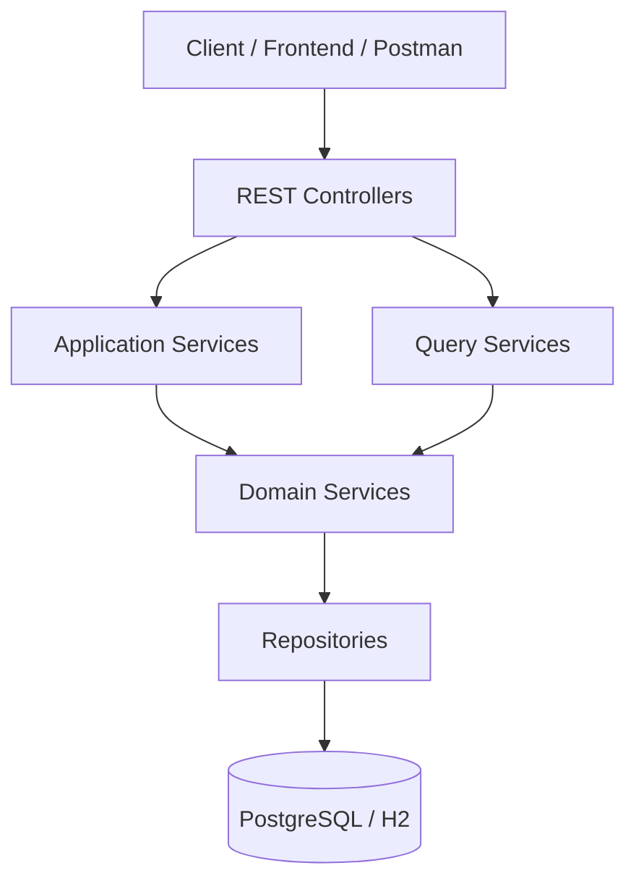

# sERPent


Modular ERP backend designed for small and medium-sized businesses.

sERPent focuses on transactional operations, warehouse-based inventory management, and a clean architecture that can evolve over time without requiring major redesigns.

The goal of the project is to provide a **practical ERP backend foundation** that supports real-world business workflows such as product management, sales, and inventory tracking.

---

# High Level Architecture

The backend follows a modular layered architecture with clear separation between API, business workflows, and persistence.



Controllers expose the API surface, services orchestrate business logic, repositories handle persistence, and the database stores transactional state.

---

# Project Status

The **core transactional and inventory backend is already implemented and functional**.

The project is currently in a **core consolidation phase**, focusing on:

- architecture consistency
- API stabilization
- improving internal workflows
- preparing the system for future modules

This repository represents an **active development project**, and additional ERP capabilities will be added incrementally.

---

# Tech Stack

- Java
- Spring Boot
- Spring Data JPA
- Hibernate
- MapStruct
- PostgreSQL
- H2 (development database)
- Flyway (database migrations)
- Postman (API testing)

---

# Current Modules

The current backend already supports the following core capabilities.

---

## Product Catalog

Features:

- product creation
- product updates
- optional SKU support
- product search by name
- active product listing

Validations:

- price cannot be null
- price cannot be negative
- SKU must be unique if present

---

## Users

Features:

- user creation
- user updates
- active user listing

Validations:

- username cannot be blank
- username must be unique
- email must be unique if present

---

## Payment Methods

Features:

- payment method creation
- updates
- active payment method listing

Validations:

- name cannot be blank
- name must be unique

---

## Warehouses

Features:

- warehouse creation
- warehouse updates
- active warehouse listing

Validations:

- name cannot be blank
- name must be unique

---

## Transactions

The system uses a **generic transaction model**.

Features:

- paginated transaction search
- filtering by type
- filtering by status
- filtering by date range
- filtering by user
- filtering by payment method
- description text search
- transaction detail retrieval

---

## Sales

Sales are implemented as a **business workflow built on top of transactions**.

Features:

- stock validation before sale
- transaction creation
- transaction detail creation
- sale record creation
- inventory movement registration

Validations:

- insufficient stock
- duplicate invoice number
- negative unit price
- product existence validation
- user existence validation
- payment method validation

---

## Inventory Movements

Inventory is **movement-based**, not stored directly in products.

Features:

- full movement history
- movement registration for sales
- movement registration for purchases

Supported movement types:

- IN
- OUT
- ADJUSTMENT_IN
- ADJUSTMENT_OUT
- TRANSFER_IN
- TRANSFER_OUT

---

## Stock Queries

Stock visibility is separated from movement history.

Features:

- stock by product
- stock by warehouse
- stock by product and warehouse
- grouped stock queries
- positive stock filtering
- low stock threshold filtering

---

## Suppliers

Supplier management supports product sourcing and cost tracking.

Entities:

- `Supplier`
- `ProductSupplier`

Features:

- supplier registration
- supplier-product association
- supplier cost tracking

---

## Expenses

Expense management allows recording operational costs.

Entities:

- `Expense`
- `ExpenseCategory`

Features:

- expense registration
- expense categorization
- optional supplier association

---

# Running the Project

## Requirements

- Java 17+
- Maven
- PostgreSQL (for production environments)

---

## Development Database

The project uses **H2 for development**.

Flyway migrations automatically create the schema and load seed data.

Seed data includes:

- admin user
- payment methods
- example products
- warehouse
- initial stock data
- example transactions

---

## Run the application

```bash
mvn spring-boot:run
```

The API will start using the default Spring Boot configuration.

---

# Roadmap

The architecture has been designed to support additional ERP capabilities.

Planned modules include:

- purchase workflows
- supplier purchasing flows
- inventory adjustments
- branch / multi-location support
- inventory planning
- accounting integration

---

# Documentation

Additional technical documentation can be found in:

```
docs/ARCHITECTURE.md
```

This document explains:

- system architecture
- module organization
- service layer conventions
- domain design decisions
- inventory model
- request workflows

---

# Development Principles

To keep the project maintainable and scalable:

- preserve the modular architecture
- avoid unnecessary abstractions
- avoid premature optimization
- implement features incrementally
- keep domain logic explicit

---

# Summary

sERPent is a **transaction-driven, inventory-centric ERP backend** designed to support real-world business workflows while remaining modular and extensible.

The current codebase already provides a strong foundation for building additional ERP capabilities while keeping the core system simple, explicit, and maintainable.