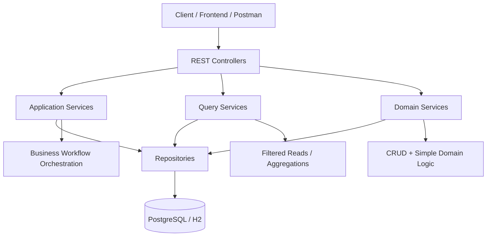
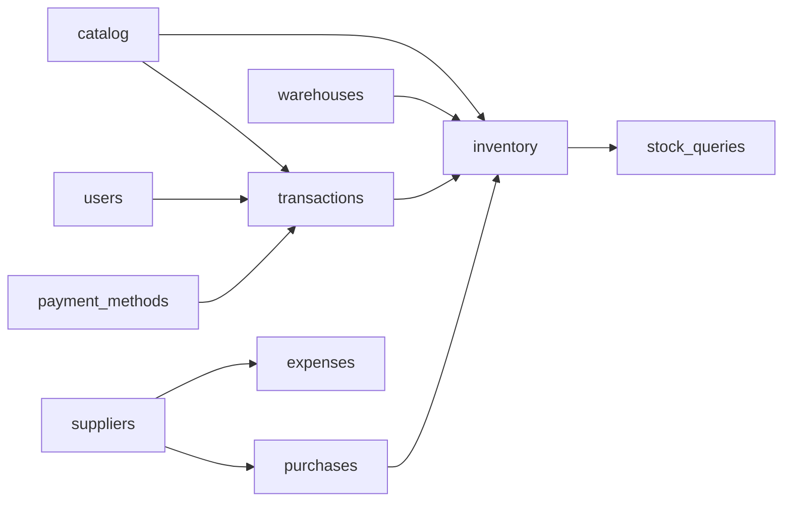
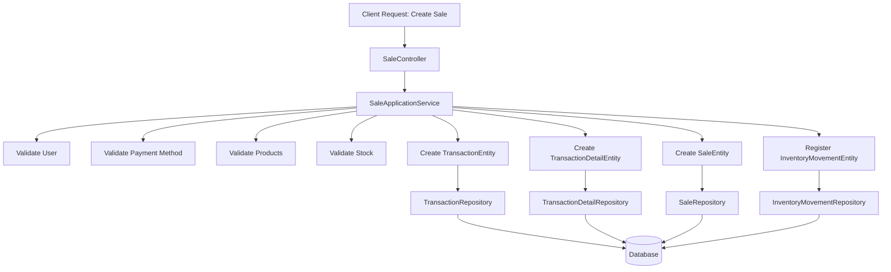

# sERPent ERP Backend Architecture

## Overview

**sERPent** is a modular ERP backend designed for small and medium-sized businesses.

The system focuses on:

- transactional operations
- warehouse-based inventory management
- extensible business workflows
- long-term maintainable architecture

The project aims to provide a **solid ERP foundation** that can grow incrementally without requiring major architectural redesigns.

---

## System Landscape

Although this repository focuses on the backend, sERPent is designed as part of a broader application ecosystem.

The full platform is planned to include multiple repositories with clearly separated responsibilities.

### Backend

**sERPent-backend** (this repository)

Responsible for:

- domain logic
- transactional workflows
- inventory management
- persistence
- REST API exposure

### Frontend

**sERPent-frontend**

An Angular client application responsible for:

- user interface
- dashboard views
- business interaction workflows
- communication with backend APIs

### Desktop Distribution

**sERPent-desktop**

An Electron-based desktop shell responsible for:

- packaging the Angular frontend
- providing desktop application distribution
- enabling cross-platform desktop deployment

This separation ensures that business logic remains independent from presentation and desktop distribution concerns, allowing the system to evolve as a maintainable multi-repository architecture.

---
# Current System Status

The **core transactional and inventory backend is already implemented and functional**.

Current modules include:

- Products
- Users
- Payment Methods
- Warehouses
- Transactions
- Transaction Details
- Sales
- Inventory Movements
- Stock Queries
- Suppliers
- Product Suppliers
- Expenses
- Expense Categories

The project is currently in a **core consolidation phase**, where the main focus is:

- stabilizing the architecture
- improving consistency
- preparing the system for future modules

---

# Technology Stack

The backend uses the following technologies:

- Java
- Spring Boot
- Spring Data JPA
- Hibernate
- MapStruct
- PostgreSQL
- H2 (development database)
- Flyway (database migrations)
- Postman (API testing)

---

# Project Goals

sERPent is intended to become a practical ERP backend for businesses that need:

- product catalog management
- warehouse-based inventory
- sales workflows
- transaction history
- stock visibility
- extensible business logic

Future modules planned for the system include:

- purchase workflows
- supplier management
- expense tracking
- stock adjustments
- branch support
- inventory planning
- accounting integration

---

# Architectural Style

The backend follows a **domain-based modular layered architecture**.

Modules are grouped by business domain rather than by technical layer.

This approach improves:

- modularity
- maintainability
- feature scalability
- domain clarity

---

# System Architecture Diagram

The following diagram shows the high-level request flow across the backend layers.



Controllers expose the API surface, services encapsulate business responsibilities, repositories handle persistence, and the database stores the transactional state.

---

# Module Structure

The base package is:

```
com.empresa.serpent
```

Main modules:

```
catalog
inventory
transactions
users
shared
```

Each module follows a consistent internal structure:

```
domain
repository
service
web
  controller
  dto
  mapper
```

### Responsibilities

| Layer | Responsibility |
|------|------|
| domain | Entities and core business models |
| repository | Persistence layer (Spring Data JPA) |
| service | Business logic and orchestration |
| web | Controllers and API models |

---

# Module Dependency Diagram

The following diagram shows the high-level relationships between the main modules.



Module relationships are organized around business capabilities, allowing the system to evolve as new ERP features are introduced.

---

# Service Layer Conventions

## ApplicationService

Used for **business workflows and orchestration logic**.

Example:

```
SaleApplicationService
```

Responsibilities may include:

- validating stock
- creating transactions
- registering movements
- coordinating related entities

---

## QueryService

Used for **filtered reads, searches, and aggregated queries**.

Examples:

```
TransactionQueryService
InventoryMovementQueryService
StockQueryService
```

Responsibilities include:

- complex filtering
- pagination
- grouped queries
- read-only operations

---

## Service

Used for **basic CRUD operations and simple domain logic**.

Examples:

```
ProductService
UserService
WarehouseService
PaymentMethodService
InventoryMovementService
SupplierService
ExpenseService
```

---

# Request Flow Example: Sale Creation

The following diagram illustrates the current sale creation workflow.



The sale workflow combines validation, transactional persistence, and inventory registration in a single business operation.

---

# Core Domain Concepts

## Transactions

`TransactionEntity` is the **operational root of the system**.

It represents business operations such as:

- SALE
- EXPENSE
- PURCHASE
- ADJUSTMENT

Related entities include:

```
TransactionEntity
TransactionDetailEntity
SaleEntity
```

---

## Inventory Model

Inventory follows a **movement-based model**.

Stock is **not stored directly in Product entities**, but derived from inventory movements.

Movement types include:

- IN
- OUT
- ADJUSTMENT_IN
- ADJUSTMENT_OUT
- TRANSFER_IN
- TRANSFER_OUT

Benefits:

- full auditability
- historical traceability
- accurate stock reconstruction
- flexibility for future operations

---

## Stock Visibility

Stock availability is separated from inventory history.

```
InventoryMovementQueryService → movement history
StockQueryService → current stock state
```

---

# Implemented Modules

## Products

Features:

- create product
- update product
- get product by id
- list active products
- search active products by name

Validations:

- price cannot be null
- price cannot be negative
- SKU optional
- SKU must be unique if present

---

## Suppliers

Responsible for managing product suppliers.

Entities:

```
SupplierEntity
ProductSupplierEntity
```

Responsibilities:

- register suppliers
- associate suppliers with products
- track supplier cost prices

---

## Expenses

Responsible for expense tracking and categorization.

Entities:

```
ExpenseEntity
ExpenseCategoryEntity
```

Responsibilities:

- record operational expenses
- categorize expenses
- optionally link expenses to suppliers

---

## Warehouses

Features:

- create warehouse
- update warehouse
- get warehouse by id
- list active warehouses

Validations:

- name cannot be blank
- name must be unique

---

## Transactions

Features:

- paginated transaction search
- filter by type
- filter by status
- filter by date range
- filter by user
- filter by payment method
- description search

---

## Sales

Features:

- validate stock before sale
- create transaction
- create transaction details
- create sale
- register inventory movements

Validations include:

- insufficient stock
- duplicate invoice number
- negative unit price
- product existence
- user existence
- payment method existence

---

## Inventory Movements

Features:

- historical movement queries
- movement registration for sales
- movement registration for purchases

Future support planned:

- adjustments
- transfers
- returns

---

## Stock

Features:

- stock by product
- stock by warehouse
- stock by product and warehouse
- positive stock filtering
- grouped stock
- low stock threshold queries

---

# Planned Modules

The architecture has been designed to support additional ERP capabilities that will be introduced progressively.

### Purchases

Will manage supplier purchase workflows and inbound inventory.

### Inventory Adjustments

Will support manual stock corrections and auditing operations.

### Branch / Multi-Warehouse Support

Future capability to support multiple business locations.

### Inventory Planning

Future features may include:

```
minimumStock
reorderPoint
reorderQuantity
```

### Product Identification Modes

Future identification modes may include:

```
MANUAL
SKU
BARCODE
PLU
```

---

# Error Handling

The system currently uses:

- `NotFoundException`
- `IllegalArgumentException`

Example error messages:

```
Product not found: 1
SKU already exists: POLLO-001
Price cannot be negative
Insufficient stock for product 1 in warehouse 1
```

---

# Entity Mapping

DTO ↔ Entity mapping is handled using **MapStruct**.

```
@Mapper(config = MapStructConfig.class)
```

This ensures strict mapping validation and Spring integration.

---

# Development Database

Development environment uses:

- H2 database
- Flyway migrations
- seed data

Seed data includes:

- admin user
- payment methods
- products
- warehouse
- stock initialization
- example transactions

---

# Production Database

Production environments use **PostgreSQL**.

Schema changes are managed through **Flyway migrations**.

---

# API Testing

Endpoints are currently tested using **Postman collections**.

The system has been validated through:

- create/update flows
- duplicate validations
- inventory validation
- stock recalculation
- transaction filtering

---

# Current Technical Debt

### Warehouse Resolution in Sales

Sales currently use a **temporary hardcoded warehouse resolution**.

Future implementations may include:

- passing `warehouseId` in requests
- resolving warehouse via user context
- branch-based resolution
- configured default warehouse

---

# Recommended Next Steps

1. consistency pass across modules
2. improve warehouse resolution in sales
3. review API response consistency
4. finalize seed data

Future modules may include:

- purchases
- stock adjustments
- branch support
- inventory planning
- accounting modules

---

# Development Principles

- preserve the existing architecture
- avoid unnecessary abstractions
- avoid introducing security too early
- avoid overengineering small modules
- verify real code before assuming missing implementations
- treat the current system as a **solid base, not a prototype**

---

# Summary

sERPent is a **modular, transaction-driven, inventory-centric ERP backend** designed for extensibility and long-term maintainability.

The current codebase provides a strong foundation for building additional ERP capabilities while keeping the core simple, explicit, and scalable.