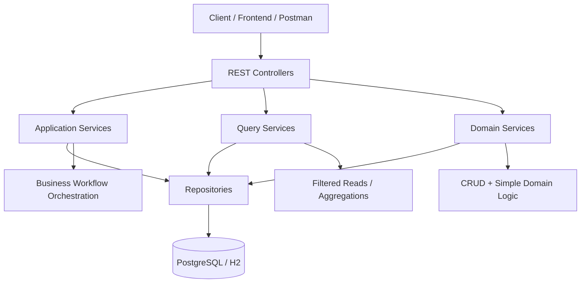
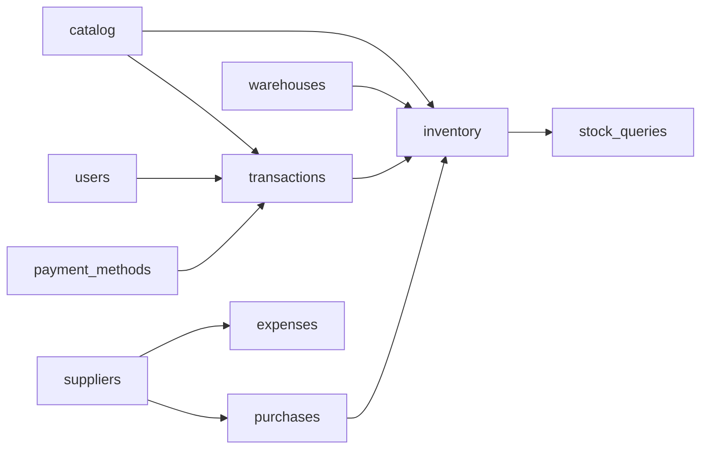
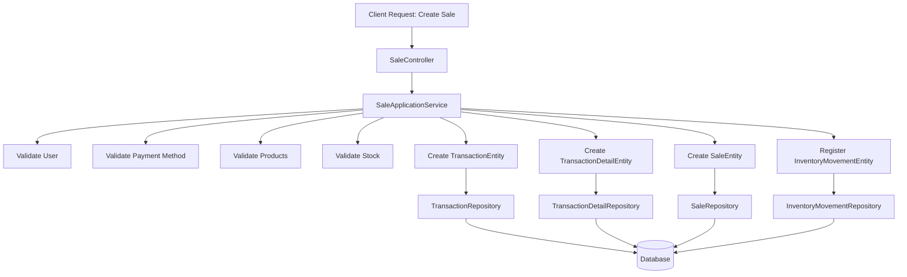
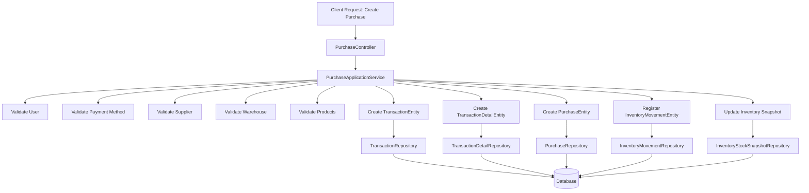

# sERPent ERP Backend Architecture

## Overview

**sERPent** is a modular ERP backend designed for small and medium-sized businesses.

The system focuses on:

- transactional operations
- warehouse-based inventory management
- extensible business workflows
- long-term maintainable architecture

The project aims to provide a **solid ERP foundation** that can grow incrementally without requiring major architectural redesigns.

---

## System Landscape

Although this repository focuses on the backend, sERPent is designed as part of a broader application ecosystem.

The full platform is planned to include multiple repositories with clearly separated responsibilities.

### Backend

**sERPent-backend** (this repository)

Responsible for:

- domain logic
- transactional workflows
- inventory management
- persistence
- REST API exposure

### Frontend

**sERPent-frontend**

An Angular client application responsible for:

- user interface
- dashboard views
- business interaction workflows
- communication with backend APIs

### Desktop Distribution

**sERPent-desktop**

An Electron-based desktop shell responsible for:

- packaging the Angular frontend
- providing desktop application distribution
- enabling cross-platform desktop deployment

This separation ensures that business logic remains independent from presentation and desktop distribution concerns, allowing the system to evolve as a maintainable multi-repository architecture.

---
# Current System Status

The **core transactional and inventory backend is already implemented and functional**.

Current modules include:

- Products
- Users
- Payment Methods
- Warehouses
- Transactions
- Transaction Details
- Sales
- Purchases
- Inventory Movements
- Inventory Stock Snapshot
- Stock Queries
- Suppliers
- Product Suppliers
- Expenses
- Expense Categories

The project is currently in a **core consolidation phase**, where the main focus is:

- stabilizing the architecture
- improving consistency
- preparing the system for future modules

The purchase workflow is already implemented at command side level and integrated with inventory.

The inventory model now uses a **ledger + snapshot hybrid approach**:

- `inventory_movements` remains the historical source of truth
- `inventory_stock_snapshot` acts as the optimized current-balance read model

This means the backend now supports both:

- auditable stock history
- fast current-stock queries

---

# Technology Stack

The backend uses the following technologies:

- Java
- Spring Boot
- Spring Data JPA
- Hibernate
- MapStruct
- PostgreSQL
- H2 (development database)
- Flyway (database migrations)
- Postman (API testing)
- JUnit 5
- Mockito
- JaCoCo

---

# Project Goals

sERPent is intended to become a practical ERP backend for businesses that need:

- product catalog management
- warehouse-based inventory
- sales workflows
- transaction history
- stock visibility
- extensible business logic

Future modules planned for the system include:

- purchase workflows
- supplier management
- expense tracking
- stock adjustments
- branch support
- inventory planning
- accounting integration

Although purchases were initially planned as a future module, the backend now already supports the **base Purchase flow**, while additional purchase query/reporting capabilities may still be expanded later.

---

# Architectural Style

The backend follows a **domain-based modular layered architecture**.

Modules are grouped by business domain rather than by technical layer.

This approach improves:

- modularity
- maintainability
- feature scalability
- domain clarity

---

# System Architecture Diagram

The following diagram shows the high-level request flow across the backend layers.



Controllers expose the API surface, services encapsulate business responsibilities, repositories handle persistence, and the database stores the transactional state.

---

# Module Structure

The base package is:

```text
com.empresa.serpent
```

Main modules:

```text
catalog
inventory
transactions
users
shared
```

Each module follows a consistent internal structure:

```text
domain
repository
service
web
  controller
  dto
  mapper
```

### Responsibilities

| Layer | Responsibility |
|------|------|
| domain | Entities and core business models |
| repository | Persistence layer (Spring Data JPA) |
| service | Business logic and orchestration |
| web | Controllers and API models |

---

# Module Dependency Diagram

The following diagram shows the high-level relationships between the main modules.



Module relationships are organized around business capabilities, allowing the system to evolve as new ERP features are introduced.

---

# Service Layer Conventions

## ApplicationService

Used for **business workflows and orchestration logic**.

Example:

```text
SaleApplicationService
```

Responsibilities may include:

- validating stock
- creating transactions
- registering movements
- coordinating related entities

Current application services include:

```text
SaleApplicationService
PurchaseApplicationService
ExpenseApplicationService
InventoryAdjustmentApplicationService
WarehouseTransferApplicationService
SaleReturnApplicationService
```

---

## QueryService

Used for **filtered reads, searches, and aggregated queries**.

Examples:

```text
TransactionQueryService
InventoryMovementQueryService
StockQueryService
```

Responsibilities include:

- complex filtering
- pagination
- grouped queries
- read-only operations

---

## Service

Used for **basic CRUD operations and simple domain logic**.

Examples:

```text
ProductService
UserService
WarehouseService
PaymentMethodService
InventoryMovementService
SupplierService
ExpenseService
```

Additional inventory-specific services now include:

```text
InventoryStockSnapshotService
StockValidationService
```

---

# Request Flow Example: Sale Creation

The following diagram illustrates the current sale creation workflow.



The sale workflow combines validation, transactional persistence, and inventory registration in a single business operation.

---

# Request Flow Example: Purchase Creation

The following diagram illustrates the current purchase creation workflow.



The purchase workflow combines supplier validation, transactional persistence, inbound inventory registration, and snapshot update in a single business operation.

---

# Core Domain Concepts

## Transactions

`TransactionEntity` is the **operational root of the system**.

It represents business operations such as:

- SALE
- EXPENSE
- PURCHASE
- ADJUSTMENT
- TRANSFER
- RETURN

Related entities include:

```text
TransactionEntity
TransactionDetailEntity
SaleEntity
PurchaseEntity
ExpenseEntity
```

---

## Inventory Model

Inventory follows a **movement-based model**.

Stock is **not stored directly in Product entities**, but derived from inventory movements.

Movement types include:

- IN
- OUT
- ADJUSTMENT_IN
- ADJUSTMENT_OUT
- TRANSFER_IN
- TRANSFER_OUT
- RETURN_IN

Benefits:

- full auditability
- historical traceability
- accurate stock reconstruction
- flexibility for future operations

---

## Inventory Snapshot Model

In addition to the movement ledger, the system now uses an optimized stock snapshot model.

### Ledger

```text
inventory_movements
```

This remains the historical source of truth.

### Snapshot

```text
inventory_stock_snapshot
```

This stores the latest current stock by:

- product
- warehouse

Snapshot fields include:

```text
snapshot_id
product_id
warehouse_id
current_stock
updated_at
last_movement_id
```

### Snapshot Service Responsibilities

`InventoryStockSnapshotService` is responsible for:

- applying a single movement to snapshot state
- applying multiple movements
- rebuilding all snapshots from the movement ledger
- reconciling ledger balances against snapshot balances
- detecting inconsistencies between historical movements and current snapshot state

This architecture provides:

- fast current stock reads
- preserved historical movement traceability
- recovery/rebuild capability in case of inconsistencies

---

## Stock Visibility

Stock availability is separated from inventory history.

```text
InventoryMovementQueryService → movement history
StockQueryService → current stock state
```

The system now reads current stock from the **snapshot model**, while movement history remains available through movement queries.

---

# Implemented Modules

## Products

Features:

- create product
- update product
- get product by id
- list active products
- search active products by name

Validations:

- price cannot be null
- price cannot be negative
- SKU optional
- SKU must be unique if present

Additional implemented inventory configuration:

- `minimumStock`
- `reorderPoint`
- `reorderQuantity`

Business rule:

- if `minimumStock` is null, the product is ignored by low-stock detection
- if `reorderPoint` is null, the product is ignored by replenishment suggestions

---

## Suppliers

Responsible for managing product suppliers.

Entities:

```text
SupplierEntity
ProductSupplierEntity
```

Responsibilities:

- register suppliers
- associate suppliers with products
- track supplier cost prices

---

## Expenses

Responsible for expense tracking and categorization.

Entities:

```text
ExpenseEntity
ExpenseCategoryEntity
```

Responsibilities:

- record operational expenses
- categorize expenses
- optionally link expenses to suppliers

The current expense flow is implemented through `ExpenseApplicationService` for command-side creation and query-side expense reads.

---

## Purchases

Responsible for supplier purchase workflows and inbound inventory.

Entity:

```text
PurchaseEntity
```

Responsibilities:

- create purchase transaction
- create purchase detail lines
- associate purchase with supplier and warehouse
- register inbound inventory movements
- update inventory snapshot automatically

This is the first implemented inbound-stock ERP flow and forms the base for more advanced supplier and replenishment capabilities.

---

## Warehouses

Features:

- create warehouse
- update warehouse
- get warehouse by id
- list active warehouses
- list all warehouses
- deactivate warehouse

Validations:

- name cannot be blank
- name must be unique

---

## Transactions

Features:

- paginated transaction search
- filter by type
- filter by status
- filter by date range
- filter by user
- filter by payment method
- description search

---

## Sales

Features:

- validate stock before sale
- create transaction
- create transaction details
- create sale
- register inventory movements
- update inventory snapshot automatically through inventory movement integration

Validations include:

- insufficient stock
- duplicate invoice number
- negative unit price
- product existence
- user existence
- payment method existence

---

## Inventory Movements

Features:

- historical movement queries
- movement registration for sales
- movement registration for purchases
- movement registration for adjustments
- movement registration for transfers
- movement registration for returns

Inventory movements now also trigger snapshot updates so that current stock state remains synchronized.

---

## Stock

Features:

- stock by product
- stock by warehouse
- stock by product and warehouse
- positive stock filtering
- grouped stock
- low stock threshold queries

These reads are now optimized through the snapshot model instead of recalculating every stock query from the full movement ledger.

---

## Inventory Snapshot

Features:

- apply movement into current stock snapshot
- rebuild snapshot table from movement ledger
- reconcile ledger vs snapshot balances
- detect snapshot inconsistencies

This module provides the optimized read-side balance model for inventory.

---

## Inventory Reporting

Implemented reporting capabilities include:

- stock summary by product
- stock by warehouse
- warehouse summary
- low stock report
- inventory movements by type
- inventory movements by warehouse
- inventory movements by product
- replenishment report based on reorder configuration

This reporting layer now benefits from the ledger + snapshot architecture.

---

# Planned Modules

The architecture has been designed to support additional ERP capabilities that will be introduced progressively.

### Purchases

The base purchase workflow is already implemented.

Future purchase-related work may still include:

- purchase query endpoints
- purchase-specific reporting
- stronger supplier integration
- purchase analytics

### Inventory Adjustments

Will support manual stock corrections and auditing operations.

The first adjustment flow is already present in the inventory layer and can be expanded further.

### Branch / Multi-Warehouse Support

Future capability to support multiple business locations.

### Inventory Planning

Future features may include:

```text
minimumStock
reorderPoint
reorderQuantity
```

Core inventory planning fields are already implemented in products. Future work may expand them into more advanced replenishment logic and supplier ordering workflows.

### Product Identification Modes

Future identification modes may include:

```text
MANUAL
SKU
BARCODE
PLU
```

### Production / Transformation Workflows

A future roadmap item is the so-called **Approach D**, where products can be transformed into other products through production/despiece-style operations.

This is especially relevant for businesses such as:

- poultry shops
- butcher shops
- food production businesses

The architecture is expected to evolve toward explicit transformation flows after purchase consolidation.

### Hybrid Architecture

A future roadmap item is an **online-first hybrid architecture** with:

- limited offline local cache
- local operation queue
- deferred synchronization against the remote backend

The backend will remain the authoritative source of truth.

---

# Error Handling

The system currently uses:

- `NotFoundException`
- `IllegalArgumentException`

Example error messages:

```text
Product not found: 1
SKU already exists: POLLO-001
Price cannot be negative
Insufficient stock for product 1 in warehouse 1
Receipt number already exists: PUR-001
```

---

# Entity Mapping

DTO ↔ Entity mapping is handled using **MapStruct**.

```text
@Mapper(config = MapStructConfig.class)
```

This ensures strict mapping validation and Spring integration.

---

# Development Database

Development environment uses:

- H2 database
- Flyway migrations
- seed data

Seed data includes:

- admin user
- payment methods
- products
- warehouse
- stock initialization
- example transactions
- example purchase flow
- inventory snapshot initialization

This allows development and manual testing of the core transactional flows without depending on production-like infrastructure.

---

# Production Database

Production environments use **PostgreSQL**.

Schema changes are managed through **Flyway migrations**.

The current schema includes both:

- movement ledger tables
- inventory snapshot tables

---

# API Testing

Endpoints are currently tested using **Postman collections**.

The system has been validated through:

- create/update flows
- duplicate validations
- inventory validation
- stock recalculation
- transaction filtering
- purchase creation
- snapshot rebuild
- snapshot reconciliation

The backend also now includes unit tests for important service-layer business logic using:

- JUnit 5
- Mockito

Coverage is measured with:

- JaCoCo

Covered services now include core flows such as:

- purchase creation
- expense creation
- product service
- supplier service
- inventory movement service
- stock query service
- snapshot service

---

# Current Technical Debt

### Warehouse Resolution in Sales

Sales currently use a **temporary hardcoded warehouse resolution**.

Future implementations may include:

- passing `warehouseId` in requests
- resolving warehouse via user context
- branch-based resolution
- configured default warehouse

### Purchase Read Side

Although the command side of Purchase is already implemented, future work may still expand:

- purchase-specific query endpoints
- purchase-specific reporting
- richer purchase read models

### Inventory Reporting Expansion

The inventory reporting layer is already functional, but future improvements may include:

- stock valuation
- turnover / rotation metrics
- more advanced operational inventory KPIs

---

# Recommended Next Steps

1. consistency pass across modules
2. improve warehouse resolution in sales
3. review API response consistency
4. finalize seed data

Future modules may include:

- purchases
- stock adjustments
- branch support
- inventory planning
- accounting modules

Near-term roadmap priorities currently include:

1. close the Purchase module properly at ERP level
2. continue with the future transformation / despiece approach (Approach D)
3. later define the hybrid online-first architecture

---

# Development Principles

- preserve the existing architecture
- avoid unnecessary abstractions
- avoid introducing security too early
- avoid overengineering small modules
- verify real code before assuming missing implementations
- treat the current system as a **solid base, not a prototype**

Additional principles reinforced during development:

- keep command-side workflows explicit
- keep query-side responsibilities separated when needed
- preserve movement history as source of truth
- use snapshot tables as optimized read models, not as replacements for the ledger

---

# Summary

sERPent is a **modular, transaction-driven, inventory-centric ERP backend** designed for extensibility and long-term maintainability.

The current codebase provides a strong foundation for building additional ERP capabilities while keeping the core simple, explicit, and scalable.

The backend now already includes:

- transactional sales
- transactional purchases
- warehouse-based inventory
- movement ledger history
- optimized stock snapshot reads
- core replenishment-related inventory reporting

This makes the current architecture significantly closer to a real ERP core while preserving room for future expansion.
